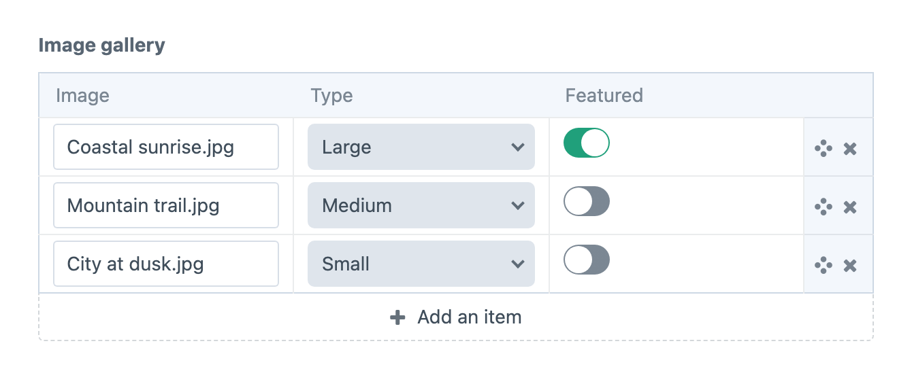
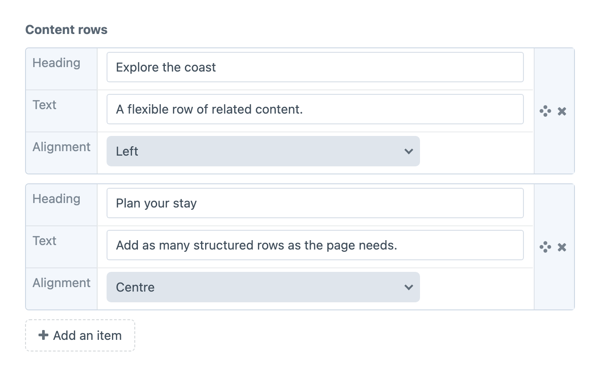
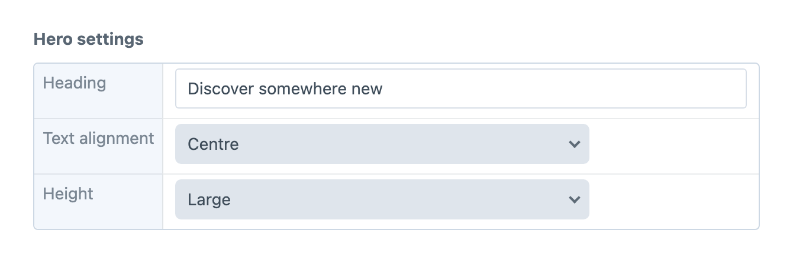
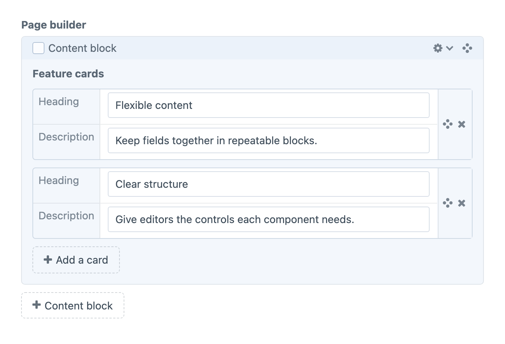

<!-- feature-intro -->
A powerful field type for adding extra flexibility to your content — Super Table is a super-charged extension, and a mix between Craft’s Table and Matrix fields. Use it as a content builder, or together with Matrix for flexible page and component layouts.
<!-- feature-intro-end -->

<!-- feature-section -->
## Three layouts for ultimate flexibility

Each Super Table field can use a Table, Row or Matrix layout. Pick the presentation that best suits the fields and the space available in your entry layout.
<!-- feature-section-end -->

<!-- feature-media media-size="large" media-shadow="false" -->
## Table layout

Looking just like a native Table field, this layout lets you add rows of content in familiar columns. Unlike Craft’s plain-text Table columns, Super Table can use Assets, Dropdowns, Entries and third-party fields. It works best with a focused set of columns.

<!-- feature-media-end -->

<!-- feature-media media-size="large" media-shadow="false" -->
## Row layout

Similar to Matrix, Row layout shows each field with its label, arranged inline where space allows. It is concise and space-efficient, especially when Super Table is used inside a Matrix field.

<!-- feature-media-end -->

<!-- feature-media media-size="large" media-shadow="false" -->
## Static layout

Static fields provide a non-repeatable group of fields. They are useful when related values belong together but editors should only complete the group once.

<!-- feature-media-end -->

<!-- feature-section media-size="large" media-shadow="false" -->
## A solution for Matrix-in-Matrix

Use Super Table inside Matrix to give each component its own repeatable content. Editors get structured nested fields without giving up the flexibility of a component-based page builder.

<!-- feature-section-end -->
